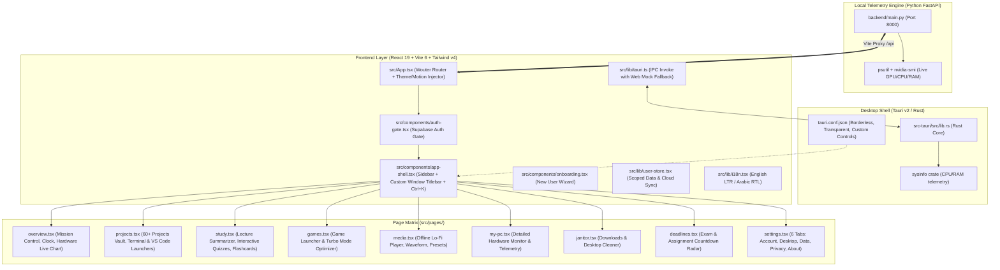

# 🏛️ RULE 01: SYSTEM ARCHITECTURE & STACK
### *CortexOS System Topography, Stack Standards & Directory Anatomy*
> **Enforcement Scope:** All backend, frontend, desktop IPC, routing, and directory organization.

---

## 1. Executive Vision & Core Stack

CortexOS is a High-Performance Native Windows 11 Neural Command Center & Second Brain engineered for developers, university students, and gamers.

- **Desktop Shell:** Tauri v2 (`src-tauri/`) with borderless custom native controls (`decorations: false`, `transparent: true`).
- **Frontend Core:** React 19, TypeScript 5.7, Vite 6 (`vite.config.ts`), Tailwind CSS v4 (`@tailwindcss/vite`), Radix UI Primitives, Lucide Icons, Framer Motion 12.
- **Client Routing:** **`wouter`** (Strictly NO `react-router-dom` or `next/router`).
- **Telemetry Backend:** Python FastAPI (`backend/main.py`) running on port `8000` via Uvicorn (`psutil` + `nvidia-smi` hardware engine).
- **Cloud Sync & Identity:** Supabase Auth & PostgreSQL sync with offline-first localStorage cache (`src/lib/supabase.ts`, `src/lib/user-store.tsx`).
- **Internationalization (i18n):** Native dual-locale engine (English LTR & Arabic RTL) with dynamic direction switching (`src/lib/i18n.tsx`).

---

## 2. Full System Topography (Mermaid Diagram)

Every AI assistant working on this codebase **MUST** visualize and respect the system architecture below before writing a single line of code:



---

## 3. Directory Anatomy

```
d:\dev26-27\app\
├── .agents/
│   ├── AGENTS.md             # Master Agent Hub & entry point
│   └── rules/                # Modular, strictly enforced rule files
├── AI.md                     # Master root documentation
├── AI_MVP_PROMPT.md          # Visual aesthetic benchmark & module spec
├── MASTER_PLAN.md            # Comprehensive project roadmap
├── package.json              # React 19, Tailwind v4, Radix, Tauri API
├── vite.config.ts            # Vite 6 config with /api proxy to FastAPI (port 8000)
├── backend/
│   ├── main.py               # FastAPI telemetry daemon (CPU, RAM, GPU via nvidia-smi)
│   └── venv/                 # Python 3 virtual environment
├── src-tauri/
│   ├── tauri.conf.json       # Window setup (decorations: false, transparent: true)
│   ├── Cargo.toml            # Rust dependencies (tauri, sysinfo, serde)
│   └── src/lib.rs            # Rust IPC handlers (get_system_info)
├── src/
│   ├── App.tsx               # Root entry, sets data-motion, data-theme, dir, lang
│   ├── index.css             # 1800+ lines of obsidian glass styling & dual-motion keyframes
│   ├── components/
│   │   ├── app-shell.tsx     # Shell layout: sidebar, window controls (min/max/close), drag region
│   │   ├── auth-gate.tsx     # Supabase sign-in/up with obsidian radial glow
│   │   ├── onboarding.tsx    # First-run setup wizard (Lang -> Theme -> Motion -> Finish)
│   │   ├── error-boundary.tsx# Graceful crash handler
│   │   ├── live-telemetry-chart.tsx # Canvas telemetry graphs
│   │   └── ui/               # 55+ Radix-powered UI components
│   ├── hooks/
│   │   ├── use-persistent.ts # LocalStorage state hook for machine-wide settings
│   │   └── use-toast.ts      # Toast notification system
│   ├── lib/
│   │   ├── i18n.tsx          # Bilingual context (t() helper, saveLocaleAndReload)
│   │   ├── user-store.tsx    # UserStoreProvider & useUserPersistent (scoped per Supabase user)
│   │   ├── supabase.ts       # Supabase client, auth helpers
│   │   └── tauri.ts          # Safe invoke() wrapper with mock fallback when in browser
│   ├── locales/
│   │   ├── en.json           # English dictionary
│   │   └── ar.json           # Arabic dictionary
│   └── pages/                # The 9 Core CortexOS Pages
```

---

## 4. Architectural Invariants (Rules of Engagement)

1. **Routing Invariant:** Never import from `react-router-dom` or `next/router`. Always use `wouter` hooks (`useLocation`, `Route`, `Switch`).
2. **IPC Invariant:** Never call `@tauri-apps/api/core` `invoke()` directly in page components. Always use the safe bridge `src/lib/tauri.ts` (`safeInvoke`), which provides graceful browser mock fallbacks when running outside the Tauri runtime.
3. **Backend Proxy Invariant:** Any frontend call to the Python hardware server must use relative paths `/api/...`. Vite's `vite.config.ts` handles forwarding to `http://localhost:8000`.
4. **State Persistence Invariant:**
   - For machine-wide local hardware/UI preferences, use `usePersistent` from `src/hooks/use-persistent.ts`.
   - For user cloud sync data (projects, notes, study materials), use `useUserPersistent` from `src/lib/user-store.tsx`.
