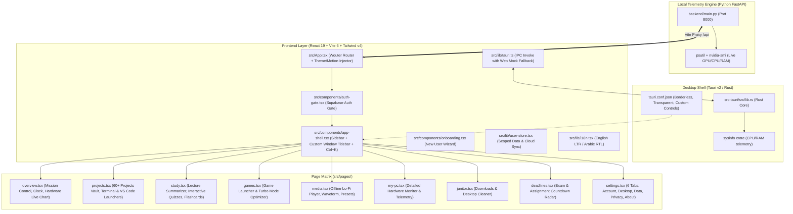

# 🧠 CORTEXOS — MASTER AI ARCHITECTURAL BLUEPRINT & GOVERNANCE
### *The Ultimate AI Reference Manual & Rules of Engagement*
> **Version:** 1.0.0 (Living Architecture Document)  
> **Target Audience:** Any AI Assistant (Claude, Gemini, GPT, DeepSeek, etc.) interacting with this repository.  
> **How to Use:** Mention `@AI.md` in any prompt to immediately load all project rules, architectural constraints, and development workflows.

---

## ⚡ 1. EXECUTIVE PROJECT IDENTITY & VISION (هوية المشروع ورؤيته)

- **Project Name:** CortexOS
- **Architect & Founder:** Abdulrahman (Abood) — Full-Stack Developer, Founder & University Student
- **Product Type:** High-Performance Native Windows 11 Neural Command Center & Second Brain
- **Aesthetic Benchmark:** Strictly matches the ultra-clean, minimal, monochromatic aesthetic of **`teampvoice.com`**
- **Core Stacks:**
  - **Desktop Shell:** Tauri v2 (Rust Daemon) with borderless custom native controls
  - **Frontend:** React 19, TypeScript 5.7, Vite 6, Tailwind CSS v4 (`@tailwindcss/vite`), Radix UI Primitives, Lucide Icons, Framer Motion 12, Wouter routing
  - **Telemetry Backend:** Python FastAPI (`backend/main.py`), Uvicorn on port 8000 (`psutil` + `nvidia-smi` hardware engine)
  - **Cloud Sync & Identity:** Supabase Auth & PostgreSQL sync with offline-first localStorage cache
  - **Internationalization:** Native dual-locale engine (English LTR & Arabic RTL) with dynamic direction switching

---

## 🗺️ 2. FULL ARCHITECTURAL MENTAL MAP (خريطة المشروع الشاملة في مخيلتك)

Any AI working on this codebase **MUST** visualize and understand the full system topography below before writing a single line of code:



### Directory Anatomy (تشريح الملفات والمجلدات):
```
d:\dev26-27\app\
├── AI.md                     # 🌟 THIS MASTER RULEBOOK (Never delete or overwrite without permission)
├── AI_MVP_PROMPT.md          # Original UI aesthetic spec
├── MASTER_PLAN.md            # Comprehensive strategic roadmap
├── package.json              # React 19, Tailwind v4, Radix, Tauri API
├── vite.config.ts            # Vite 6 config with /api proxy to FastAPI (port 8000)
├── backend/
│   ├── main.py               # FastAPI telemetry daemon (CPU, RAM, GPU via nvidia-smi)
│   └── venv/                 # Python 3 virtual environment
├── src-tauri/
│   ├── tauri.conf.json       # Window setup (decorations: false, transparent: true)
│   ├── Cargo.toml            # Rust dependencies (tauri, sysinfo, serde)
│   └── src/lib.rs            # Rust IPC handlers (get_system_info)
├── src/
│   ├── App.tsx               # Root entry, sets data-motion, data-theme, dir, lang
│   ├── index.css             # 1800+ lines of obsidian glass styling & dual-motion keyframes
│   ├── components/
│   │   ├── app-shell.tsx     # Shell layout: sidebar, window controls (min/max/close), drag region
│   │   ├── auth-gate.tsx     # Supabase sign-in/up with obsidian radial glow
│   │   ├── onboarding.tsx    # First-run setup wizard (Lang -> Theme -> Motion -> Finish)
│   │   ├── error-boundary.tsx# Graceful crash handler
│   │   ├── live-telemetry-chart.tsx # Canvas telemetry graphs
│   │   └── ui/               # 55+ Radix-powered UI components
│   ├── hooks/
│   │   ├── use-persistent.ts # LocalStorage state hook for machine-wide settings
│   │   └── use-toast.ts      # Toast notification system
│   ├── lib/
│   │   ├── i18n.tsx          # Bilingual context (t() helper, saveLocaleAndReload)
│   │   ├── user-store.tsx    # UserStoreProvider & useUserPersistent (scoped per Supabase user)
│   │   ├── supabase.ts       # Supabase client, auth helpers
│   │   └── tauri.ts          # Safe invoke() wrapper with mock fallback when in browser
│   ├── locales/
│   │   ├── en.json           # English dictionary
│   │   └── ar.json           # Arabic dictionary
│   └── pages/
│       ├── overview.tsx      # System cockpit & telemetry
│       ├── projects.tsx      # Project manager
│       ├── study.tsx         # University study assistant
│       ├── games.tsx         # Turbo gaming hub
│       ├── media.tsx         # Audio lounge
│       ├── my-pc.tsx         # Hardware monitor
│       ├── janitor.tsx       # File cleaner
│       ├── deadlines.tsx     # Exam radar
│       ├── settings.tsx      # Full settings management
│       └── not-found.tsx     # 404 page
```

---

## 🎬 3. THE GOLDEN DUAL-MOTION ENGINE (نظام الأنميشن الثنائي الصارم: ضعيف / قوي)

### 📌 The Requirement (الشرط الإلزامي):
The user explicitly requires:
> **"إذا ضفت صفحة يعمللها أنميشن ضعيف وأنميشن قوي، لأنو بالإعدادات في خيار أنميشن ضعيف وأنميشن قوي."**

In CortexOS, animations are **NOT** optional or one-size-fits-all. The user switches between two distinct modes via Settings (`src/pages/settings.tsx`) and Onboarding (`src/components/onboarding.tsx`), stored in `localStorage.getItem('cortex-motion')` and rendered onto `<html data-motion="...">`:

| Mode | Technical Value | UI Name | Arabic Name | Characteristics & Rules |
| :--- | :--- | :--- | :--- | :--- |
| **Light & Snappy** | `"minimal"` | `Light & Snappy` | **خفيف وسريع** | `0ms` instant response, no delays, no transitions, zero bouncing/sliding. Optimized for low-end hardware & maximum productivity. |
| **Fluid & Cinematic** | `"cinematic"` | `Fluid & Cinematic` | **سينمائي وسلس** | 60 FPS smooth entrances (`cortex-page-cinematic 280ms cubic-bezier(0.16, 1, 0.3, 1)`), staggered cards cascade, subtle depth lifts (`translateY(-2px)`), radiant cyan glow on hover. |

### 🛠️ How the Dual-Motion System Works Under the Hood:
1. **Root Configuration in `src/App.tsx`:**
   ```tsx
   const [motion] = usePersistent<string>('cortex-motion', 'cinematic');
   useEffect(() => {
     document.documentElement.setAttribute('data-motion', motion);
   }, [motion]);
   ```
2. **Global CSS Rules in `src/index.css`:**
   ```css
   /* Mode 1: Minimal (Light & Snappy) */
   [data-motion="minimal"] .page-in,
   [data-motion="minimal"] .page-in *,
   [data-motion="minimal"] .settings-tab-pane,
   [data-motion="minimal"] .settings-tab-pane * {
     animation: none !important;
   }
   [data-motion="minimal"] * {
     transition-duration: 0ms !important;
     animation-duration: 0ms !important;
   }
   [data-motion="minimal"] .pulse-dot,
   [data-motion="minimal"] .pulse-dot-green,
   [data-motion="minimal"] .tiny-led,
   [data-motion="minimal"] .motion-dot {
     animation: none !important;
   }

   /* Mode 2: Cinematic (Fluid & Cinematic) */
   [data-motion="cinematic"] .page-in {
     animation: cortex-page-cinematic 280ms cubic-bezier(0.16, 1, 0.3, 1) both;
   }
   [data-motion="cinematic"] .page-in .module-card,
   [data-motion="cinematic"] .page-in .project-card,
   [data-motion="cinematic"] .page-in .game-card {
     animation: cortex-card-cascade 300ms cubic-bezier(0.16, 1, 0.3, 1) both;
   }
   [data-motion="cinematic"] .page-in .module-card:nth-child(1) { animation-delay: 20ms; }
   [data-motion="cinematic"] .page-in .module-card:nth-child(2) { animation-delay: 40ms; }
   [data-motion="cinematic"] .page-in .module-card:nth-child(3) { animation-delay: 60ms; }
   [data-motion="cinematic"] .page-in .module-card:nth-child(4) { animation-delay: 80ms; }
   ```

### 📋 Strict Rules for the AI When Adding or Modifying Any Page or Component:
1. **Always inherit `.page-in`:** In `src/components/app-shell.tsx`, the main view is wrapped in:
   ```tsx
   <div className="page-wrap page-in" key={location}>{children}</div>
   ```
   Never remove `key={location}` because it is what triggers page re-entrance upon route changes!
2. **Staggered Child Animations:** If you add cards, panels, or grid items to a new page, assign them classes like `.module-card`, `.game-card`, or add explicit cinematic cascading rules in `index.css`:
   ```css
   [data-motion="cinematic"] .new-page-card {
     animation: cortex-card-cascade 280ms cubic-bezier(0.16, 1, 0.3, 1) both;
   }
   [data-motion="cinematic"] .new-page-card:hover {
     transform: translateY(-2px);
     box-shadow: 0 8px 24px rgba(0, 0, 0, 0.4), 0 0 16px hsl(var(--primary) / .25);
   }
   ```
3. **If using Framer Motion:**
   Never hardcode fixed animations that ignore `data-motion`. Always inspect the active motion mode:
   ```tsx
   import { usePersistent } from '@/hooks/use-persistent';
   
   const [motion] = usePersistent<'minimal' | 'cinematic'>('cortex-motion', 'cinematic');
   const isCinematic = motion === 'cinematic';

   <motion.div
     initial={isCinematic ? { opacity: 0, y: 8 } : false}
     animate={{ opacity: 1, y: 0 }}
     transition={isCinematic ? { duration: 0.28, ease: [0.16, 1, 0.3, 1] } : { duration: 0 }}
   >
     ...
   </motion.div>
   ```
4. **Zero Layout Shifts:** In both modes, transitions must never cause layout jumps or flickering scrollbars.

---

## 🚀 4. NEW USER ONBOARDING & SETTINGS EXTENSIBILITY (إعدادات المستخدم الجديد والتوسعة المستقبلية)

### 📌 The Requirement (الشرط الإلزامي):
The user explicitly requires:
> **"بدي تشرح للـ AI إنو في قائمة إعدادات للمستخدم الجديد، وهي الإعدادات يمكن بالمستقبل بدي أضيف عليها أكيد، عشان لسى المشروع مش كامل."**

CortexOS is under active iterative development. The first-time user flow and the settings system are designed as a **modular pipeline**. Any AI working on this project must be prepared to seamlessly add new configuration steps, options, and parameters.

### 🧩 Current Onboarding Flow (`src/components/onboarding.tsx`):
1. **Step 0 — Language:** User selects English (`en`) or Arabic (`ar`). Triggers RTL/LTR switch and saves to `cortex-locale`.
2. **Step 1 — Theme:** User chooses Obsidian Dark (`dark`) or Titanium Light (`light`). Updates `cortex-theme` and `data-theme`.
3. **Step 2 — Motion & Animation:** User chooses 60 FPS Fluid & Smooth (`cinematic`) or 30 FPS Minimal & Fast (`minimal`). Updates `cortex-motion` and `data-motion`.
4. **Step 3 — Completion:** "Launch CortexOS" action, clears onboarding state.

### 📐 How to Add a New Onboarding Step or New Settings Option (The Golden Blueprint):

Whenever the user asks you to add a new setting or a new onboarding step (e.g., Default Code Editor path, Default AI Model selection, Auto-start on boot, Notification sound, Projects directory picker):

#### Step 1: Determine Storage Scope
- **Machine-Wide Setting (Local to this PC):** Use `usePersistent<T>('cortex-your-key', defaultValue)` from `src/hooks/use-persistent.ts`.
- **User-Scoped Setting (Synced to Cloud per Supabase User):** Use `useUserPersistent<T>('your-key', defaultValue)` from `src/lib/user-store.tsx`.

#### Step 2: Add Translations to Both Locales
Never hardcode strings! Add bilingual keys in both:
- `src/locales/en.json`:
  ```json
  "onboarding": {
    "yourNewFeature": "AI Engine Selection",
    "yourNewFeatureDesc": "Choose your primary neural model for code and study."
  }
  ```
- `src/locales/ar.json`:
  ```json
  "onboarding": {
    "yourNewFeature": "محرك الذكاء الاصطناعي",
    "yourNewFeatureDesc": "اختر النموذج الأساسي للكود والمحاضرات الجامعية."
  }
  ```

#### Step 3: Extend `src/components/onboarding.tsx`
1. Expand the step count in progress dots:
   ```tsx
   {[0, 1, 2, 3, 4].map((i) => (...))}
   ```
2. Adjust `nextStep` ceiling condition:
   ```tsx
   const nextStep = () => {
     if (step < 4) setStep(step + 1);
     else onComplete();
   };
   ```
3. Add step markup using the standardized obsidian cards:
   ```tsx
   {step === 3 && (
     <div className="wizard-step animate-in fade-in zoom-in-95 duration-300">
       <div className="wizard-header text-center mb-8">
         <div className="wizard-icon-box">...</div>
         <h1>{t('onboarding.yourNewFeature')}</h1>
         <p>{t('onboarding.yourNewFeatureDesc')}</p>
       </div>
       <div className="wizard-options-grid">
         {/* Standard Cortex option cards */}
       </div>
     </div>
   )}
   ```

#### Step 4: Mirror the Setting in `src/pages/settings.tsx`
**Crucial Rule:** Any setting introduced in Onboarding **MUST** also be adjustable later inside `src/pages/settings.tsx` (in the relevant tab: `account`, `desktop`, `data`, `privacy`, or `about`). The UI card pattern must match:
```tsx
<div className="desktop-settings-group">
  <div className="group-header">
    <Icon size={16} className="text-cyan" />
    <div>
      <b>{t('settings.desktop.yourSection')}</b>
      <small className="block text-muted-foreground">{t('settings.desktop.yourSectionDesc')}</small>
    </div>
  </div>
  {/* Card toggles or inputs */}
</div>
```

---

## 🚫 5. STRICT ANTI-SLOP & ANTI-HALLUCINATION RULES ("ممنوعات الكود والهبد")

1. **NO Fake or Uninstalled Packages:**
   - Check `package.json` before importing! Only use installed libraries (`wouter`, `@radix-ui/*`, `lucide-react`, `framer-motion`, `@tanstack/react-query`, `@supabase/supabase-js`, `recharts`, `clsx`, `tailwind-merge`).
   - Do NOT attempt to install `react-router-dom` or `next/router` — the app uses **`wouter`**.
2. **NO Broken Switch / Toggle Buttons (CRITICAL):**
   - The toggle thumb (white circle) **MUST NEVER OVERFLOW OR JUMP OUTSIDE** the capsule!
   - CortexOS uses a custom pixel-perfect `.toggle` and `.toggle-on` class in `src/index.css`:
     - Height: `22px`, Width: `42px`, Thumb: `16px` diameter.
     - LTR translation: `translateX(20px)`.
     - RTL translation: `translateX(-20px)`.
   - If using `@radix-ui/react-switch`, ensure padding and sizes strictly prevent overflow.
3. **NO Washed-Out Colors, Pink Tints, or Cartoon Gradients:**
   - **Background Surfaces:** Pure Deep Black `#000000` and Deep Obsidian `#050505` (`hsl(220 20% 3%)`).
   - **Panels/Cards:** `hsl(var(--card))` / `#0a0a0a` with hairline zinc borders `border border-zinc-800/80`.
   - **Primary Accent:** TempVoice Electric Cyan `#00aff4` (`hsl(197 100% 48%)`).
   - **Secondary Accent:** Subtle Emerald for online status `#10b981`.
   - **NO pink, purple, or pastel gradients.**
4. **NO Mobile Bottom Bar on Windows Desktop:**
   - This is a native Windows 11 desktop app wrapped in Tauri. A mobile bottom navigation bar is strictly prohibited. All navigation stays in the sleek sticky left sidebar or the top command bar.
5. **NO Generic Disclaimers or Fake Simulated Warnings:**
   - Do NOT write cheesy placeholder copy like *"This is a simulated demo, no system settings were changed."*
   - Write real, authoritative engineering telemetry copy: *"High-performance power plan engaged · RAM cache purged · Background dev threads suspended."*
6. **NO Window Decoration Collisions:**
   - The Tauri window is frameless (`decorations: false`).
   - The top header in `src/components/app-shell.tsx` has `data-tauri-drag-region` on the bar, and interactive buttons (search, min, max, close) have `data-tauri-drag-region="false"`.
   - Never break or hide the custom window controls (`-`, `□`, `✕`).
7. **Always Support RTL (Arabic) and LTR (English):**
   - Use logical CSS properties (`border-inline-start`, `padding-inline-end`, `margin-inline-start`) or explicit `[dir="rtl"]` overrides.
   - Text alignment and chevron orientations must dynamically adapt.

---

## 💻 6. HOW TO RUN & VERIFY THE SYSTEM (أوامر التشغيل والفحص)

- **Run Full Desktop Mode (Tauri + Vite + Python Server):**
  ```powershell
  pnpm run desktop
  ```
- **Run Web Frontend + Python Telemetry Server:**
  ```powershell
  pnpm run dev
  ```
- **Run Only Web UI (Vite on port 5173):**
  ```powershell
  pnpm run dev:ui
  ```
- **Run Only Python Telemetry Server (FastAPI on port 8000):**
  ```powershell
  pnpm run dev:server
  ```
- **TypeScript Typecheck (MANDATORY before finishing tasks):**
  ```powershell
  pnpm run typecheck
  ```
- **Production Build:**
  ```powershell
  pnpm run build
  ```

---

## 🎯 7. SUMMARY CHEAT SHEET FOR THE AI (ملخص سريع قبل تنفيذ أي كود)

1. **Before writing code:** Read the open files and inspect the existing pattern. Never assume.
2. **When creating a page:**
   - Add it to `src/pages/<page-name>.tsx`.
   - Register route in `src/App.tsx`.
   - Add navigation link in `src/components/app-shell.tsx` (in `navItems` and `navGroups`).
   - Add English title/labels to `src/locales/en.json` and Arabic to `src/locales/ar.json`.
   - **Enforce Dual-Motion:** Make sure it has instant responsiveness in `minimal` mode and smooth staggered cascade in `cinematic` mode.
3. **When adding a setting:**
   - Determine local PC (`usePersistent`) vs cloud user (`useUserPersistent`).
   - Mirror in `src/components/onboarding.tsx` if it is a first-time choice, and in `src/pages/settings.tsx` for ongoing control.
   - Add i18n keys for both Arabic and English.
4. **When editing CSS:**
   - Stick to `src/index.css` tokens. Dark, sharp, high contrast, zinc hairline borders, electric cyan highlights.
5. **Always run `pnpm run typecheck`** to guarantee zero compilation or type errors.
