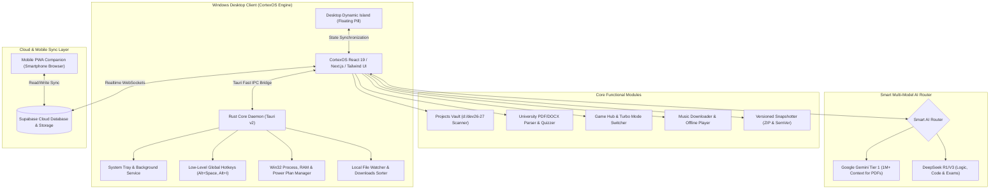

# 🧠 CortexOS: The Supreme Developer, Student & Gamer Neural Command Center
### *Native Windows Desktop Engine + Desktop Dynamic Island + 60+ Projects Vault + University Study AI + Game Turbo Optimizer + Embedded Supabase Studio*

> **Project Name:** CortexOS  
> **Architect & Founder:** Abdulrahman (Abood) — Full-Stack Developer, Founder & University Student  
> **Core Architecture:** Tauri v2 (Rust Core Daemon) + React 19 / Next.js 15 + Tailwind CSS v4 + Supabase Cloud Sync  
> **Target OS:** Windows 11 Desktop (with Responsive Mobile PWA Companion)  
> **Design Language:** Cyber-Obsidian Glassmorphism, Floating Dynamic Island, Zero-Lag, Real-Time Interactivity

---

## 📌 1. الرؤية الهندسية الشاملة للمشروع (Executive Vision & Persona)

**CortexOS** ليس مجرد تطبيق عادي أو مجرد واجهة Todo، بل هو **نظام تشغيل شخصي وعقل ثانٍ فائق الذكاء (Neural Second Brain & Mission Control)** تم تصميمه خصيصاً ليناسب حياة عبد الرحمن بجميع أبعادها:
1. **كمطور ومؤسس مشاريع حية:** إدارة وتنظيم أكثر من 60 مشروعاً في مجلد `d:\dev26-27`، توليد أساسات المشاريع بالذكاء الاصطناعي لتجنب البدء من الصفر، صيد الـ Ports المعلقة، والتحكم بقواعد بيانات Supabase دون فتح المتصفح.
2. **كطالب جامعي:** سحب ملفات المحاضرات والسلايدات (PDF و DOCX)، تلخيصها، توليد اختبارات تدريبية للامتحانات، والاستماع إليها صوتياً أثناء التنقل، مع رادار للمواعيد النهائية للتسليم.
3. **كلاعب (Gamer):** كشف الألعاب المثبتة على الجهاز بنقرة زر، وتفعيل وضع التيربو الخارق (Turbo Boost) لتعليق خوادم التطوير الثقيلة وتفريغ الرام واستغلال كامل قوة العتاد.
4. **كإنسان يبحث عن البساطة:** جزيرة تفاعلية عائمة في أعلى الشاشة (Dynamic Island)، مكنسة تلقائية لترتيب سطح المكتب ومجلد التنزيلات، مشغل ومحمل موسيقى بدون نت ولا إعلانات، ومزامنة حية لكل الملاحظات مع الهاتف عبر Supabase.

---

## 🧠 2. الخريطة الذهنية الشاملة للنظام (Full System Mind Map)

```mermaid
mindmap
  root((CortexOS))
    🏝️ جزيرة سطح المكتب (Dynamic Island)
      مؤقت الدراسة والعمل الحي
      موجات الصوت المتفاعلة (Audio Waveform)
      تنبيهات رادار الامتحانات والتسليم
      مؤشر وضع الألعاب والتيربو
      نافذة سريعة لتسجيل الأفكار وفتح VS Code
    📁 منظم 60+ مشروع (Projects Vault)
      فحص مجلد d:/dev26-27 بالكامل
      تصنيف (نشط / مباع للعملاء / تجارب / مؤرشف)
      فتح فوري في VS Code أو Terminal
      تنظيف node_modules لتوفير المساحة
    🚀 مولد المشاريع الذكي (AI Scaffolder)
      قوالب جاهزة (SaaS, Discord Bot, Desktop, Landing)
      مولد مشاريع بالـ AI من وصف بسيط
      توليد الهيكل وحزم المكتبات فوراً
    🎓 المحرك الجامعي الذكي (University Study Hub)
      سحب وقراءة ملفات PDF و DOCX
      تلخيص السلايدات وتبسيط المفاهيم (ELI5)
      توليد اختبارات تدريبية للامتحانات (MCQ)
      تحويل الملخصات لصوت واستماع (TTS)
      اقتراح مقاطع يوتيوب ومراجع تعليمية
    🎮 مركز الألعاب ووضع التيربو (Game Hub & Turbo)
      كشف ألعاب Steam و Epic و Riot وقرص D:
      تعليق عمليات التطوير الثقيلة بالخلفية
      تفريغ كاش الرام وتفعيل خطة الطاقة القصوى
      كتم الإشعارات وحماية البنج (Ping)
    🧹 مكنسة سطح المكتب والتنزيلات (Clean Janitor)
      ترتيب ملفات سطح المكتب المتناثرة تلقائياً
      فرز التنزيلات ونقل الـ PDF للجامعة والـ Zip للمشاريع
      عزل وحذف ملفات التثبيت القديمة المؤقتة
    💾 النسخ الاحتياطي مع الإصدارات (Versioned Backup)
      ضغط المشروع في Zip متجاهلاً node_modules
      ترقيم تلقائي للإصدارات (v1.0.0, v1.0.1)
      ترتيب زمني من الأحدث للأقدم مع زر الاستعادة
    🚨 رادار المواعيد والامتحانات (Deadline Radar)
      عداد تنازلي دقيق للامتحانات وتسليم المشاريع
      تنبيه تحذيري في الجزيرة قبل 48 و 24 ساعة
    🎵 محمل ومشغل الموسيقى أوفلاين (Music Hub)
      تحميل الأغاني وتراكات الـ Lo-Fi برابط مباشر (MP3)
      مشغل صوتي محلي بدون نت وبدون إعلانات
      تكامل كامل مع موجات الجزيرة التفاعلية
    🤖 الموجه الذكي للذكاء الاصطناعي (Multi-Model AI)
      Google Gemini (Tier 1): لملفات الـ PDF الضخمة والسلايدات
      DeepSeek (V3 & R1): للكود والمنطق وحل مسائل الامتحانات
      محدد يدوي للمودل وتتبع التكلفة والتوكنز
    🗄️ مصفوفة Supabase المدمجة (Embedded Studio)
      مستكشف الجداول والتعديل المباشر (Inline Edit)
      محرر ومفسر استعلامات SQL مع تشغيل فوري
      إدارة مستخدمي الـ Auth بدون فتح المتصفح
    ⌨️ مصفوفة الاختصارات وشريط الأوامر (Shortcuts & Spotlight)
      شريط أوامر طافي Alt+Space للبحث الفوري
      تخصيص كامل لجميع اختصارات الكيبورد
      مزامنة سحابية لحظية مع الهاتف المحمول
```

---

## 🏗️ 3. المعمارية الهندسية وتدفق البيانات (System Architecture)



---

## 🎛️ 4. التفصيل الهندسي للأركان الـ 12 لـ CortexOS

### 1. 🏝️ جزيرة سطح المكتب التفاعلية (Desktop Dynamic Island)
* شريط زجاجي عائم بأعلى الشاشة يتقلص ويتمدد بسلاسة عبر Framer Motion:
* **الحالة المصغرة (Compact Pill):**
  * مؤقت الدراسة والعمل الحي (`24:50`).
  * موجة صوتية متفاعلة (Audio Waveform) ترقص مع الموسيقى أو قراءة المحاضرة.
  * تنبيهات رادار الامتحانات والتسليم القريب (`⚠️ تسليم مشروع بعد 18 ساعة`).
  * نقطة مؤشر وضع التيربو للألعاب أو عدم التشتيت.
* **الحالة الموسعة (Expanded Island):**
  * تفتح بـ `Alt + I` أو عند مرور الماوس:
    * أزرار مشغل الموسيقى (Play/Pause, Next, Prev, Scrub).
    * زر فوري: "Launch Current Project in VS Code".
    * صندوق تسجيل الأفكار والملاحظات السريعة.

### 2. 📁 منظم وفاحص 60+ مشروع في `d:\dev26-27` (Projects Vault)
* فحص تلقائي لكافة المجلدات داخل `d:\dev26-27` واستخراج معلومات كل مشروع.
* **التصنيف الذكي:**
  * 🟢 **Active**: مشاريع قيد التطوير اليومي.
  * 💰 **Sold / Client**: مشاريع بيعت لعملاء وأردت أرشفة نسختها.
  * 🧪 **Experiments & MVPs**: التجارب السريعة والأفكار.
  * 📦 **Archived**: مشاريع قديمة مجمدة.
* **أزرار سريعة لكل مشروع:**
  * فتح بـ VS Code بضغطة زر.
  * تشغيل السيرفر (`npm run dev`).
  * فتح مجلد الويندوز أو المستودع.
  * تنظيف مجلدات `node_modules` القديمة لتوفير الجيجابايت على القرص D.

### 3. 🚀 مولد المشاريع الذكي بالـ AI (Smart Project Scaffolder)
* بدلاً من البدء من الصفر وتضييع نصف ساعة في كل فكرة:
* **قوالب جاهزة مسبقاً:** SaaS Starter (Next.js 15 + Supabase + Tailwind + Auth), Discord Bot, Tauri Desktop App, Landing Page.
* **مولد المشاريع بالذكاء الاصطناعي:** تكتب فكرتك بجملة واحدة، والـ AI يجهز لك هيكل المجلدات، ملفات الإعدادات، وحزم المكتبات في مجلد جديد داخل `d:\dev26-27` فوراً.

### 4. 🎓 المحرك الدراسي والجامعي الذكي (University Study Engine)
* **سحب ملفات PDF و DOCX:** سحب وإفلات أي سلايدات أو محاضرات واستخراج نصوصها وجداولها فوراً.
* **المعلم الذكي والتلخيص (ELI5):** شرح المفاهيم الصعبة بلغة بسيطة، وتلخيص المحاضرات الطويلة في ملخص مركز.
* **صانع الاختبارات التدريبية (Exam Prep & Quiz Generator):** توليد اختبارات تفاعلية (MCQ) وصح أو خطأ مع تصحيح تلقائي وشرح للإجابات الصحيحة.
* **الاستماع الصوتي (Text-to-Speech):** الاستماع لملخص المحاضرة بصوت ناعم وطبيعي مع إمكانية تسريع الصوت (1.25x / 1.5x) أثناء التنقل.
* **مقترح المراجع الذكي:** ترشيح أفضل فيديوهات يوتيوب وروابط تعليمية لشرح فكرة المحاضرة.

### 5. 🎮 مركز الألعاب ووضع الألعاب الخارق (Game Hub & Turbo Game Mode)
* **كاشف الألعاب التلقائي:** فحص الألعاب المثبتة على قرص `C:` وقرص `D:` ومكتبات (Steam, Epic, Riot, EA, Battle.net) وعرضها مع بوستراتها وزر تشغيل فوري.
* **وضع التيربو (Turbo Boost):**
  * تعليق خوادم التطوير الثقيلة بالخلفية (Node.js, Docker) وتخفيض أولويتها إلى Idle لمنع أي هبوط في الفريمات (FPS Drops).
  * تفريغ كاش الرام المعلق في الويندوز بنقرة زر.
  * تفعيل خطة الطاقة القصوى (Ultimate Performance Plan).
  * كتم الإشعارات لمنع الخروج المفاجئ من اللعبة وحماية البنج (Ping).
  * زر "Restore Work Mode" لإعادة بيئة التطوير كما كانت فور الانتهاء من اللعب.

### 6. 🧹 مكنسة ومنظم سطح المكتب والتنزيلات (Clean & Organize Desktop Janitor)
* ترتيب سطح مكتب الويندوز بضغطة زر واحدة وفرز الملفات المتناثرة إلى مجلدات مرتبة (سلايدات الجامعة، المشاريع، الوسائط).
* فرز مجلد التنزيلات تلقائياً: نقل الـ PDF للمواد، الـ Zip للمشاريع، وتنظيف ملفات التثبيت القديمة المؤقتة.
* اختصار سريع `Alt + C` ينهي الفوضى في ثانية واحدة مع تقرير بما تم تنظيفه.

### 7. 💾 نظام النسخ الاحتياطي وإصدارات المشاريع (Versioned Project Backup)
* زر بجانب كل مشروع لعمل Backup مضغوط في ZIP متجاهلاً `node_modules` بذكاء.
* ترقيم تسلسلي تلقائي للإصدارات (`v1.0.0`, `v1.0.1`, `v1.1.0`) مع خانة لكتابة ملاحظة التعديل.
* سجل إصدارات زمني مرتب من **الأحدث إلى الأقدم** مع التاريخ، الوقت، الحجم، وزر الاستعادة بنقرة واحدة.

### 8. 🚨 رادار المواعيد والامتحانات (Deadline & Exam Radar)
* متابعة مواعيد تسليم المشاريع الجامعية، مواعيد الامتحانات، وتجديد السيرفرات بعداد تنازلي دقيق.
* تكامل ذكي مع الجزيرة التفاعلية (Dynamic Island): تنبيه تحذيري قبل الموعد بـ 48 أو 24 ساعة لتبقى متنبهاً دائماً.

### 9. 🎵 محمل ومشغل الموسيقى الدراسي أوفلاين (Music Downloader & Player)
* تحميل أي أغنية أو تراك Lo-Fi برابط مباشر من يوتيوب أو غيره وحفظها بصيغة MP3 محلياً على جهازك.
* مشغل صوتي مدمج بدون إعلانات وبدون نت لتشغيل موسيقى التركيز أثناء المذاكرة.
* تكامل كامل مع الموجات الصوتية داخل الجزيرة التفاعلية.

### 10. 🤖 الموجه الذكي للذكاء الاصطناعي متعدد النماذج (Multi-Model AI Router)
* **Google Gemini (Tier 1 - رصيد 60$):** لمعالجة السلايدات وملفات الـ PDF الضخمة بفضل نافذة السياق العملاقة (1M+ Tokens) بسرعة وسعر شبه معدوم.
* **DeepSeek (V3 & R1):** للتفكير المنطقي المعقد، حل مسائل الامتحانات الصعبة، وتوليد كود المشاريع.
* محدد يدوي للمودل في الواجهة لمراقبة التكلفة والتوكنز بدقة.

### 11. 🗄️ مصفوفة Supabase المدمجة (Embedded Supabase Studio)
* مستكشف الجداول (Table Explorer) مع ميزة التعديل المباشر في الخلايا (Inline Edit).
* محرر ومفسر استعلامات SQL مع إمكانية التشغيل السريع `Ctrl + Enter`.
* إدارة مستخدمي الـ Auth ومراقبة صحة قاعدة البيانات دون الحاجة لفتح موقع Supabase بالمتصفح.

### 12. ⌨️ مصفوفة الاختصارات وشريط الأوامر الطافي (Shortcuts & Spotlight)
* شريط أوامر طافي `Alt + Space` (Spotlight) للبحث في المشاريع، تدوين الملاحظات، وسؤال الذكاء الاصطناعي.
* واجهة إعدادات مخصصة لتعديل وتخصيص كل شورت كت في النظام.
* مزامنة حية للملاحظات والمشاريع مع الهاتف عبر موقع ويب خفيف متصل بـ Supabase.

---

## 📊 5. هيكلية قاعدة بيانات Supabase الكاملة (Full SQL Schema)

```sql
-- 1. جدول ملف المستخدم
CREATE TABLE public.profiles (
    id UUID REFERENCES auth.users ON DELETE CASCADE PRIMARY KEY,
    username TEXT UNIQUE NOT NULL,
    full_name TEXT,
    avatar_url TEXT,
    role TEXT DEFAULT 'developer_student',
    settings JSONB DEFAULT '{}'::jsonb,
    created_at TIMESTAMPTZ DEFAULT NOW(),
    updated_at TIMESTAMPTZ DEFAULT NOW()
);

-- 2. جدول تصنيف ومشاريع ديف (d:/dev26-27 Projects)
CREATE TABLE public.local_projects (
    id UUID DEFAULT gen_random_uuid() PRIMARY KEY,
    user_id UUID REFERENCES public.profiles(id) ON DELETE CASCADE,
    project_name TEXT NOT NULL,
    folder_path TEXT NOT NULL,
    status TEXT DEFAULT 'active', -- active, sold, experiment, archived
    tech_stack TEXT[] DEFAULT ARRAY[]::TEXT[],
    client_name TEXT,
    price_sold NUMERIC DEFAULT 0,
    github_repo_url TEXT,
    last_opened_at TIMESTAMPTZ DEFAULT NOW(),
    created_at TIMESTAMPTZ DEFAULT NOW()
);

-- 3. جدول النسخ الاحتياطية وإصدارات المشاريع (Versioned Backups)
CREATE TABLE public.project_backups (
    id UUID DEFAULT gen_random_uuid() PRIMARY KEY,
    project_id UUID REFERENCES public.local_projects(id) ON DELETE CASCADE,
    version_tag TEXT NOT NULL, -- e.g. v1.0.0, v1.0.1
    backup_file_path TEXT NOT NULL,
    file_size_bytes BIGINT DEFAULT 0,
    commit_note TEXT,
    created_at TIMESTAMPTZ DEFAULT NOW()
);

-- 4. جدول المواد الجامعية والملفات (University Study Files)
CREATE TABLE public.study_courses (
    id UUID DEFAULT gen_random_uuid() PRIMARY KEY,
    user_id UUID REFERENCES public.profiles(id) ON DELETE CASCADE,
    course_code TEXT NOT NULL, -- CS301
    course_name TEXT NOT NULL, -- Computer Networks
    instructor TEXT,
    created_at TIMESTAMPTZ DEFAULT NOW()
);

CREATE TABLE public.study_documents (
    id UUID DEFAULT gen_random_uuid() PRIMARY KEY,
    course_id UUID REFERENCES public.study_courses(id) ON DELETE CASCADE,
    document_title TEXT NOT NULL,
    file_type TEXT NOT NULL, -- pdf, docx
    local_file_path TEXT NOT NULL,
    extracted_text TEXT,
    ai_summary TEXT,
    audio_summary_path TEXT,
    created_at TIMESTAMPTZ DEFAULT NOW()
);

-- 5. جدول رادار المواعيد والامتحانات (Deadline Radar)
CREATE TABLE public.deadlines (
    id UUID DEFAULT gen_random_uuid() PRIMARY KEY,
    user_id UUID REFERENCES public.profiles(id) ON DELETE CASCADE,
    title TEXT NOT NULL,
    category TEXT DEFAULT 'exam', -- exam, project_submission, server_renewal, personal
    target_date TIMESTAMPTZ NOT NULL,
    reminder_hours_before INT DEFAULT 24,
    is_completed BOOLEAN DEFAULT false,
    created_at TIMESTAMPTZ DEFAULT NOW()
);

-- 6. جدول الأغاني والموسيقى المحملة (Offline Music Library)
CREATE TABLE public.music_tracks (
    id UUID DEFAULT gen_random_uuid() PRIMARY KEY,
    user_id UUID REFERENCES public.profiles(id) ON DELETE CASCADE,
    track_title TEXT NOT NULL,
    artist TEXT DEFAULT 'Unknown',
    local_mp3_path TEXT NOT NULL,
    duration_seconds INT DEFAULT 0,
    source_url TEXT,
    playlist_tag TEXT DEFAULT 'Study Lo-Fi',
    created_at TIMESTAMPTZ DEFAULT NOW()
);

-- 7. جدول الملاحظات والأفكار السريعة (Quick Notes & Brain Dumps)
CREATE TABLE public.notes (
    id UUID DEFAULT gen_random_uuid() PRIMARY KEY,
    user_id UUID REFERENCES public.profiles(id) ON DELETE CASCADE,
    title TEXT NOT NULL,
    content TEXT DEFAULT '', -- Markdown
    tags TEXT[] DEFAULT ARRAY[]::TEXT[],
    is_pinned BOOLEAN DEFAULT false,
    created_at TIMESTAMPTZ DEFAULT NOW(),
    updated_at TIMESTAMPTZ DEFAULT NOW()
);
```

---

## 🔒 6. الأمان والتجهيز التجاري (Rust HWID Protection & Security)

إذا رغبت مستقبلاً في بيع البرنامج للمطورين والطلاب حول العالم:
1. **قفل الترخيص بعتاد الجهاز (HWID Licensing):**
   * كود محرك الترخيص مبني بلغة **Rust** ومترجم لكود آلة أصلي (Native Machine Binary).
   * استخراج بصمة عتاد فريدة من اللوحة الأم والمعالج، وربط مفتاح الترخيص بهذا الجهاز لمنع نسخه.
2. **التشفير المحلي الحصين (AES-256-GCM Vault):**
   * مفاتيح Google Gemini و DeepSeek ومفاتيح Supabase مشفرة ومحمية محلياً عبر Windows DPAPI.

---

## 🚀 7. خطة التنفيذ الشاملة (Execution Phases)

| المرحلة | الأهداف والمخرجات التقنية |
| :--- | :--- |
| **المرحلة 1: النواة والجزيرة** | بناء واجهة البرنامج + الجزيرة التفاعلية (Dynamic Island) مع عداد الوقت والموجة الصوتية |
| **المرحلة 2: مركز الموسيقى** | واجهة تحميل الأغاني برابط (Downloader) + مشغل محلي أوفلاين مدمج مع الجزيرة |
| **المرحلة 3: منظم المشاريع** | فحص مجلد `d:\dev26-27`، التصنيفات (Active/Sold/Experiments)، وفتح VS Code |
| **المرحلة 4: النسخ الاحتياطي** | نظام النسخ الاحتياطي ZIP مع الإصدارات التلقائية (`v1.0.0`) وسجل التاريخ |
| **المرحلة 5: مركز الألعاب والتيربو** | كاشف ألعاب الجهاز + تفعيل وضع التيربو وتفريغ الرام وتعليق عمليات التطوير |
| **المرحلة 6: مكنسة سطح المكتب** | مكنسة التنظيف لسطح المكتب والتنزيلات بنقرة زر وفرز الملفات حسب نوعها |
| **المرحلة 7: المحرك الجامعي** | سحب ملفات PDF/DOCX، تلخيصها، توليد الاختبارات (MCQ)، والاستماع الصوتي |
| **المرحلة 8: موجه الـ AI المتعدد** | دمج Google Gemini Tier 1 للملفات الكبيرة + DeepSeek للكود والمسائل والامتحانات |
| **المرحلة 9: مصفوفة الإعدادات** | تخصيص اختصارات الكيبورد ومزامنة الهاتف عبر Supabase |

---

## 🎯 الخلاصة:
هذه الوثيقة تمثل **المرجع الهندسي الكامل والمفصل بنسبة 100%**، تجمع كافة أفكارك وميزاتك بدون أي اختصار أو حذف.
الملف محفوظ بالكامل في: `d:\dev26-27\app\MASTER_PLAN.md`.
