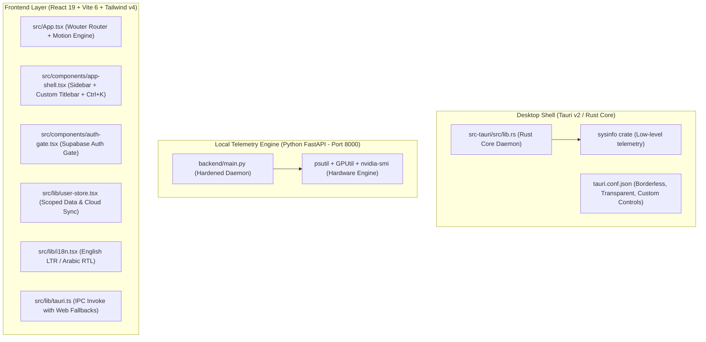

# 🧠 CortexOS — High-Performance Neural Command Center & Second Brain

<p align="center">
  
</p>

<p align="center">
  <strong>A native Windows 11 Neural Command Center and Second Brain engineered for developers, university students, and power users.</strong>
</p>

<p align="center">
  
  
  
  
  
  
  
  
</p>

---

## ⚡ Overview

**CortexOS** is an ultra-fast, native desktop application engineered to unify development workflows, live hardware telemetry, AI-assisted academic research, and gaming system optimization into a single seamless dashboard.

### Key Architectural Pillars
- **Monochromatic Minimalist Identity:** Precision aesthetics inspired by `teampvoice.com` with deep pitch blacks (`#000000` / `#050505`), hairline zinc borders (`border-zinc-800/80`), and focused electric cyan accents (`#00aff4`).
- **Dual-Motion Engine:** Built-in animation toggle supporting both:
  - **Minimal:** 0ms instantaneous response for latency-sensitive power users.
  - **Cinematic:** Fluid 60 FPS cascading micro-interactions and transitions.
- **Offline-First with Cloud Sync:** Local-first reactivity with transparent cloud backup and synchronization powered by **Supabase**.
- **Bilingual Engine:** First-class bidirectional support for both English (LTR) and Arabic (RTL) with dynamic layout flipping.

---

## 🏛️ System Architecture



---

## 🧩 Core Modules

| Module | Route / File | Description |
| :--- | :--- | :--- |
| **🖥️ Mission Control** | `src/pages/overview.tsx` | Central nerve center with digital clock, hardware radar, system shortcuts, and live vitals. |
| **📁 Projects Vault** | `src/pages/projects.tsx` | Smart indexer managing 60+ repositories with one-click VS Code and terminal launching. |
| **📚 Study Hub** | `src/pages/study.tsx` | AI lecture summarizer, interactive quiz generator, and spaced-repetition flashcards. |
| **🎮 Games & Turbo** | `src/pages/games.tsx` | Game library launcher paired with a Turbo Optimizer to suppress background processes. |
| **🎵 Lo-Fi Media Deck** | `src/pages/media.tsx` | Offline ambient music player with real-time audio waveform visualizer and curated presets. |
| **💻 My PC Hardware** | `src/pages/my-pc.tsx` | Real-time telemetry monitoring CPU/GPU clock speeds, thermals, RAM load, and drive health. |
| **🧹 System Janitor** | `src/pages/janitor.tsx` | One-click maintenance tool to purge temporary caches, recycled items, and orphan files. |
| **⏳ Deadlines Radar** | `src/pages/deadlines.tsx` | Countdown radar tracking upcoming university exams, assignments, and milestones. |
| **⚙️ Settings** | `src/pages/settings.tsx` | Comprehensive configuration for account, themes, animations, cloud backups, and security. |

---

## 📋 Prerequisites

Before running CortexOS, verify that your development environment meets the following requirements:

- **Operating System:** Windows 10 / 11 (64-bit)
- **Node.js:** `>= 18.0.0` (Node 20 LTS recommended)
- **Package Manager:** `pnpm` `>= 9.0.0` (`npm install -g pnpm`)
- **Python:** `>= 3.11` or `3.12` (with `venv` support)
- **Rust Toolchain:** (Required for native desktop builds via Tauri)
  - Install via [rustup.rs](https://rustup.rs/)
  - Microsoft Visual Studio C++ Build Tools (Desktop development with C++)

---

## ⚙️ Installation & Setup

### 1. Clone the Repository
```bash
git clone https://github.com/3boodx7D/CortexOS.git
cd CortexOS
```

### 2. Install Frontend Dependencies
```powershell
pnpm install
```

### 3. Setup Python Backend Daemon
Create the local virtual environment inside the `backend` directory and install dependencies:
```powershell
# Create virtual environment
python -m venv backend/venv

# Install required packages
.\backend\venv\Scripts\pip install -r backend/requirements.txt
```

### 4. Configure Environment Variables
Copy the template configuration file:
```powershell
copy .env.example .env
```
Update `.env` with your Supabase credentials and optional AI keys:
```env
PORT=8000
VITE_API_URL=http://localhost:8000
VITE_SUPABASE_URL=https://your-project.supabase.co
VITE_SUPABASE_ANON_KEY=your-supabase-anon-key
```

---

## 🚀 How to Run

CortexOS provides flexible execution modes to match your development workflow:

### 🌟 1. Full Native Desktop App (Recommended)
Spawns the full Tauri v2 desktop window alongside the Vite development server and the Python hardware engine concurrently:
```powershell
pnpm run desktop
```

---

### 🌐 2. Web Development Mode (Vite + Python Daemon)
Launches the browser frontend at `http://localhost:5173` and the FastAPI hardware daemon at `http://localhost:8000` simultaneously:
```powershell
pnpm run dev
```
> 💡 **Quick Launch on Windows:** You can also simply double-click **`dev.bat`** in the root folder to start both services instantly in a single window.

---

### 🎨 3. Frontend Only (Browser Mock Mode)
Runs Vite in browser isolation without the Python backend daemon (uses smart mock data for hardware IPC):
```powershell
pnpm run dev:ui
```
*Accessible at:* `http://localhost:5173`

---

### ⚡ 4. Backend Engine Only (FastAPI Daemon)
Runs only the Python telemetry server on port `8000`:
```powershell
pnpm run dev:server
```
*Accessible at:* `http://localhost:8000`  
*Interactive Swagger UI:* `http://localhost:8000/docs`

---

## 📡 Ports & Endpoints

| Service | Address | Description |
| :--- | :--- | :--- |
| **Frontend UI (Vite)** | `http://localhost:5173` | Main interactive web application |
| **Telemetry Engine (FastAPI)** | `http://localhost:8000` | Local hardware telemetry & project runner |
| **API Documentation (Swagger)** | `http://localhost:8000/docs` | Interactive OpenAPI documentation |
| **System Health Check** | `http://localhost:8000/api/system/health` | Backend status & engine verification |

---

## 📁 Project Directory Anatomy

```text
CortexOS/
├── .agents/                 # AI Orchestration, Architectural Rules & Enforcement Guidelines
├── backend/                 # Python FastAPI Telemetry Engine
│   ├── routers/             # API Route Handlers (system, projects, ai)
│   ├── services/            # Hardware monitoring, IDE launchers, JWT validators
│   ├── main.py              # Server entrypoint with CORS & Loopback security guards
│   └── requirements.txt     # Python dependency manifest
├── public/                  # Static web assets and application icons
├── src/                     # React 19 Frontend
│   ├── components/          # Radix UI primitives and custom interface components
│   ├── hooks/               # Custom React hooks (hardware telemetry, persistent storage)
│   ├── lib/                 # Tauri IPC bridges, Supabase client, i18n engine
│   ├── locales/             # Bilingual dictionaries (en.json, ar.json)
│   ├── pages/               # Primary application module views
│   ├── App.tsx              # Root component, router configuration, theme wrappers
│   └── index.css            # Tailwind CSS v4 design tokens and utility classes
├── src-tauri/               # Tauri v2 Desktop Engine (Rust)
│   ├── src/                 # Rust core implementation and system hooks
│   └── tauri.conf.json      # Window styling, permissions, and Content Security Policy (CSP)
├── dev.bat                  # One-click Windows batch launcher
├── dev.ps1                  # PowerShell development script
├── package.json             # NPM package scripts and dependency specifications
├── vite.config.ts           # Vite bundler configuration with backend proxy
└── tsconfig.json            # Strict TypeScript compiler options
```

---

## 🛠️ Available Scripts

| Script | Command | Purpose |
| :--- | :--- | :--- |
| `pnpm run desktop` | `tauri dev` | Launches the complete Tauri v2 desktop application |
| `pnpm run dev` | `concurrently ...` | Runs Vite frontend + FastAPI backend in parallel |
| `pnpm run dev:ui` | `vite` | Starts the Vite development server only |
| `pnpm run dev:server` | `uvicorn backend.main:app` | Starts the Python FastAPI hardware daemon only |
| `pnpm run typecheck` | `tsc --noEmit` | Executes strict TypeScript type verification across all files |
| `pnpm run build` | `vite build` | Compiles optimized production bundle into `dist/` |

---

## 🛡️ Security & Quality Assurance

- **Zero-Error Type Checking:** The codebase strictly enforces clean compilation with zero TypeScript errors via `pnpm run typecheck`.
- **Loopback Hardening:** The FastAPI telemetry daemon strictly binds to `127.0.0.1` and verifies `X-Cortex-Daemon-Token` headers to protect against cross-origin attacks.
- **Content Security Policy (CSP):** The Tauri desktop container enforces a strict CSP in `tauri.conf.json` to prevent arbitrary code injection and cross-site scripting (XSS).

---

<p align="center">
  Crafted with precision for speed, elegance, and peak developer productivity.
</p>
