# 🚀 خطة تنفيذ نظام التحديثات التلقائي وواجهة التحميل والوضع غير المتصل (CortexOS Update & Offline System)

> **تحديث مهم:** بناءً على فحص واجهة التحميل المميزة والموجودة حالياً في البرنامج (`.auth-gate-loading` مع الشعار النابض `auth-logo-pulse`، وخلفية التوهج العصبي `auth-glow-orb`، وشريط العنوان المخصص `WindowControls`)، تم اعتماد **نفس هذه المعمارية البصرية الفائقة** كقاعدة أساسية لواجهة التحديث وتنزيل الحزم، وواجهة انقطاع الإنترنت (Offline Gate)، لضمان التناسق الكامل مع هوية CortexOS.

---

## 🎨 استلهام واجهة التحميل الحالية في البرنامج (Visual Architecture)

تعتمد شاشة التحميل الحالية في [auth-gate.tsx](file:///d:/dev26-27/app/src/components/auth-gate.tsx) و [index.css](file:///d:/dev26-27/app/src/index.css#L468-L495) على المكونات التالية:
1. **شريط التحكم بالنوافذ الأصلي:** `auth-titlebar` مع `WindowControls` ودعم سحب النافذة `data-tauri-drag-region`.
2. **التوهج العصبي المحيطي:** `auth-glow-backdrop` مع هالة نيون سماوية `auth-glow-orb auth-glow-primary`.
3. **الشعار المتنفس والمضيء:** `auth-logo-pulse` و `auth-logo-pulse-img` مع تأثير `logo-breathe` وظلال متوهجة (`drop-shadow`).
4. **الخط الأحادي العصبي:** `CORTEX` + `OS` السماوي بحجم وتنسيق خط `JetBrains Mono`.

سنقوم بتطوير مكوّن مشترك قابل لإعادة الاستخدام `NeuralLoadingView` مبني تماماً على هذه الواجهة، ويتم استخدامه في:
- **تحميل وتثبيت التحديث (Update Downloading):** مع شريط تقدم نيون سماوي، وبيانات النسبة المئوية والحجم المحمل (MB/Total MB).
- **حالة انقطاع الإنترنت (Offline Handling):** مع شارة عدم الاتصال الهادئة، ورسالة تفيد بأن الوضع المحلي يعمل بكفاءة، مع زر "إعادة محاولة الاتصال".

---

## 📌 الأهداف المحدثة (Refined Objectives)

1. **الربط التلقائي مع GitHub Releases (`3boodx7D/CortexOS`):**
   - تهيئة Tauri v2 لفحص ملف `latest.json` المرفوع مع كل Release على مستودعك.
   - التحقق من التوقيع الرقمي المشفر (Ed25519 Signature) لضمان الأمان ومطابقة الملفات.
2. **واجهة التحديث في الإعدادات ([settings.tsx](file:///d:/dev26-27/app/src/pages/settings.tsx)):**
   - عرض رقم الإصدار الحالي المثبت ديناميكياً.
   - زر يدوي **"فحص التحديثات"** (Check for Updates) مع مؤشر فحص دوار.
   - مفتاح تبديل (Switch) متناسق للـ **"فحص التلقائي عند بدء التشغيل"** (مع التزام صارم بقواعد عدم خروج زر الـ Switch عن كبسولته).
   - عرض ملاحظات التحديث (Release Notes / Changelog) وتاريخ الإصدار فور توفره.
   - زر "تحميل وتثبيت" يطلق واجهة التحميل.
3. **واجهة التحميل التفاعلية وشريط التقدم (Update Downloader UI):**
   - بطاقة مصغرة داخل الإعدادات + خيار العرض الكامل المتناسق مع واجهة التحميل الأصلية (`.auth-gate-loading`).
   - شريط تقدم نيون مضيء بلون `#00aff4`.
   - زر عريض "إعادة تشغيل البرنامج لتطبيق التحديث" فور اكتمال التنزيل.
4. **التعامل الذكي مع انقطاع الإنترنت وعدم وجود اتصال (Offline Resilience):**
   - رصد حالة الشبكة عبر `navigator.onLine` وهواك `useNetworkStatus`.
   - في حال كان المستخدم غير متصل بالإنترنت:
     - منع الفشل الصامت أو ظهور أخطاء برمجية في الكونسول.
     - إظهار واجهة التحميل العصبية بحالة "الوضع غير المتصل (Offline Mode)"، مع توضيح أن جميع وظائف البرنامج المحلية (المشاريع، المستودع الدراسي، فحص الجهاز) متاحة وتعمل، مع زر "إعادة فحص الاتصال".
5. **سكربت الأتمتة والتوقيع ([scripts/build-release.js](file:///d:/dev26-27/app/scripts/build-release.js)):**
   - توقيع حزمة الـ NSIS Setup بمفتاح التشفير.
   - إنشاء ملف الـ `latest.json` تلقائياً ووضعه في `dist-installer/` لرفعه على GitHub Releases مع الـ `.exe` والـ `.sig`.

---

## 🏗️ مخطط تدفق النظام (System Flowchart)

```mermaid
graph TD
    subgraph Client ["تطبيق CortexOS لدى المستخدم"]
        Start[تشغيل التطبيق أو فتح الإعدادات] --> CheckNet{هل الإنترنت متصل؟}
        
        CheckNet -->|لا / Offline| OfflineScreen["واجهة NeuralLoadingView<br/>(بنمط auth-gate-loading الأصلي)<br/>• حالة: غير متصل بالإنترنت<br/>• زر: إعادة المحاولة"]
        OfflineScreen -->|الضغط على إعادة المحاولة| CheckNet
        
        CheckNet -->|نعم / Online| FetchManifest[قراءة latest.json من GitHub Releases]
        FetchManifest --> IsNew{يوجد إصدار أحدث؟}
        
        IsNew -->|لا| UpToDate[أنت على أحدث إصدار · LED أخضر]
        IsNew -->|نعم| ShowUpdateCard[إظهار الإصدار الجديد وملاحظات التحديث]
        
        ShowUpdateCard --> ClickDownload[المستخدم يضغط: تحميل وتثبيت]
        ClickDownload --> DownloadScreen["واجهة NeuralLoadingView<br/>• شعار CortexOS النابض<br/>• شريط تقدم التحميل النيون %<br/>• الحجم المحمل بالميجابايت"]
        
        DownloadScreen --> FinishDownload[اكتمل التحميل والتحقق من التوقيع]
        FinishDownload --> RestartApp[زر: إعادة التشغيل لتطبيق التحديث الآن]
    end

    subgraph GitHubRepo ["GitHub Releases (3boodx7D/CortexOS)"]
        ReleaseHost[Releases]
        ReleaseHost --> ManifestFile[latest.json]
        ReleaseHost --> BinInstaller[CortexOS-Setup-vX.X.X.exe]
        ReleaseHost --> SigFile[CortexOS-Setup.exe.sig]
    end
```



---

## 🛠️ التغييرات والملفات المستهدفة (Target Files)

### 1. إعدادات ومحرك Tauri (Rust Backend)

#### [Cargo.toml](file:///d:/dev26-27/app/src-tauri/Cargo.toml)
- إضافة:
  - `tauri-plugin-updater = "2"`
  - `tauri-plugin-process = "2"`

#### [lib.rs](file:///d:/dev26-27/app/src-tauri/src/lib.rs)
- تسجيل الإضافات داخل دالة `run()`:
  ```rust
  #[cfg(desktop)]
  {
      app.handle().plugin(tauri_plugin_updater::Builder::new().build())?;
      app.handle().plugin(tauri_plugin_process::init())?;
  }
  ```

#### [tauri.conf.json](file:///d:/dev26-27/app/src-tauri/tauri.conf.json)
- تفعيل بناء حزم التحديث: `"bundle": { "createUpdaterArtifacts": true }`.
- إضافة مفتاح التوقيع العام ونقطة الوصول في `plugins`:
  ```json
  "plugins": {
    "updater": {
      "pubkey": "<PUBLIC_KEY_HERE>",
      "endpoints": [
        "https://github.com/3boodx7D/CortexOS/releases/latest/download/latest.json"
      ]
    }
  }
  ```

#### [capabilities/default.json](file:///d:/dev26-27/app/src-tauri/capabilities/default.json)
- إضافة صلاحيات: `"updater:default"`, `"process:default"`, `"process:allow-restart"`.

---

### 2. واجهة التحميل والتحديث المشتركة (Shared Neural Components)

#### `src/components/ui/neural-loading-view.tsx`
- مكوّن موحّد مبني بالكامل على كود وجماليات `.auth-gate-loading`:
  - يتضمن `auth-titlebar` مع أزرار التحكم بالنوافذ `WindowControls`.
  - خلفية التوهج العصبي `auth-glow-backdrop` و `auth-glow-orb`.
  - الشعار النابض `auth-logo-pulse` مع أنيميشن `logo-breathe`.
  - إمكانية العمل في 3 أنماط:
    1. **وضع التنزيل (Downloading Mode):** يظهر شريط تقدم متناسق، النسبة المئوية، الحجم، وزر إعادة التشغيل عند الانتهاء.
    2. **وضع انقطاع الإنترنت (Offline Mode):** يظهر شارة عدم الاتصال، نص توضيحي بأن الميزات المحلية تعمل، وزر إعادة المحاولة.
    3. **وضع الفحص والانتظار (Checking / Loading Mode).**

#### `src/hooks/use-network-status.ts`
- هوك لمراقبة حالة الاتصال الحقيقية بالإنترنت (`isOnline`, `checkOnline`).

#### `src/hooks/use-updater.ts`
- هوك إدارة التحديثات:
  - ربط فحص التحديثات مع حالة الاتصال.
  - إرجاع الحالات: `idle`, `checking`, `available`, `downloading`, `downloaded`, `upToDate`, `offline`, `error`.
  - دعم التنزيل مع تتبع التقدم `progress` بالبايت والميجابايت.
  - تنفيذ `relaunch()` لإعادة التشغيل بسلاسة.

---

### 3. تكامل صفحة الإعدادات واللغات (Settings & Locales)

#### [src/pages/settings.tsx](file:///d:/dev26-27/app/src/pages/settings.tsx)
- في تبويب `about` (حول النظام والإصدار):
  - عرض رقم الإصدار الديناميكي.
  - بطاقة **"نظام تحديثات CortexOS"**:
    - حالة التحديث (محدّث لأحدث نسخة / يوجد تحديث / غير متصل بالإنترنت).
    - زر "فحص التحديثات" اليدوي.
    - مفتاح تبديل "فحص التحديثات تلقائياً عند بدء التشغيل" (مع التأكد التام من عدم خروج مقبض الـ Switch عن كبسولته).
    - إذا وجد تحديث: عرض زر "تحميل وتثبيت" وملاحظات الإصدار.

#### [src/locales/en.json](file:///d:/dev26-27/app/src/locales/en.json) و [src/locales/ar.json](file:///d:/dev26-27/app/src/locales/ar.json)
- إضافة كافة مفاتيح الترجمة الإنجليزية والعربية المطابقة بنسبة 100% لكافة الحالات (الفحص، التحميل، عدم الاتصال، إعادة التشغيل).

---

### 4. سكربت الأتمتة ([scripts/build-release.js](file:///d:/dev26-27/app/scripts/build-release.js))

- دعم توقيع حزمة التثبيت واستخراج ملف `.sig`.
- توليد ملف `latest.json` تلقائياً بصيغة Tauri الرسمية متضمناً رقم الإصدار، التوقيع، ورابط التحميل على GitHub.
- حفظ جميع ملفات الـ Release في مجلد `dist-installer/` لرفعها على GitHub بضغطة زر.

---

## 🧪 خطة التحقق والاختبار (Verification Plan)

1. **التحقق من الواجهات (Visual Parity):**
   - مطابقة واجهة التحميل والتحديث بنسبة 100% مع واجهة `auth-gate-loading` الأصلية في الألوان والظلال والأنيميشن.
2. **اختبار انقطاع الإنترنت (Offline Test):**
   - فصل الشبكة واختبار سلوك الفحص، والتأكد من إظهار واجهة عدم الاتصال اللطيفة مع زر إعادة المحاولة دون أي تجميد أو خطأ بالكونسول.
3. **فحص الأنواع وبناء الكود:**
   - تشغيل `pnpm run typecheck` والتأكد من نجاح الفحص دون أي أخطاء.
   - التحقق من تجميع Rust بنجاح.
